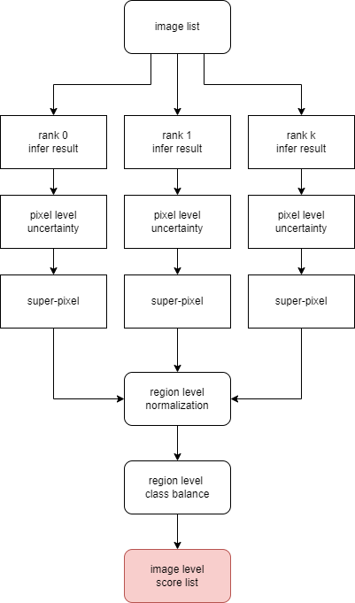

# ymir-mmsegmentation

## training

| hyper-parameter | type | example | usage |
| - | - | - | - |
| config_file | str | configs/fastscnn/fast_scnn_lr0.12_8x4_160k_cityscapes.py | the basic config file |
| max_iters | int | 20000 | training iters |
| interval | int | 2000 | evaluation and checkpoint interval |
| samples_per_gpu | int | 2 | batch size per gpu |
| workers_per_gpu | int | 2 | num_workers per gpu |
| max_keep_ckpts | int | -1, 3 | the number of saved weight file |
| save_least_file | bool | True | save all the weight file or last weight file only |
| cfg_options | str | optimizer.lr=0.02 | view utils/train.py for detail |
| args_options | str | --seed 25 | view utils/train.py for detail |
| export_format | str | seg-mask:raw | view ymir for detail |
| shm_size | str | 128G | share memory for docker container, recommand 128G for 4 gpu|

### result.yaml demo

```
best_stage_name: best
map: 0.6434000000000001
model_stages:
  best:
    files:
    - fast_scnn_lr0.12_8x4_160k_cityscapes.py
    - best_mIoU_iter_4000.pth
    mAP: 0.6434000000000001
    stage_name: best
    timestamp: 1667802743
  last:
    files:
    - fast_scnn_lr0.12_8x4_160k_cityscapes.py
    - latest.pth
    mAP: 0.6434
    stage_name: last
    timestamp: 1667802761
```

### todo
- [ ] image size

## infer
- no additional hyper-param
- [ ] infer support for large dataset (N>10000)

### todo
- [ ] batch infer
- [ ] batch mining

## mining

| hyper-parameter | type | example | usage |
| - | - | - | - |
| mining_algorithm | str | RSAL, RIPU | mining algorithm |
| superpixel_algorithm | str | slico, slic, mslic, seeds | superpixel algorithm |
| uncertainty_method | str | BvSB | method to compute uncertainty |
| shm_size | str | 128G | use 32G shm_size per gpu |
| max_superpixel_per_image | int | 1024 | max number of superpixel in one image |
| max_kept_mining_image | int | 5000 | max number of image to label |
| topk_superpixel_score | int | 3 | minimal number of superpixel to label in one image |
| class_balance | bool | True, False | consider class balance or not |
| fp16 | bool | True, False | change model to fp16 to make mining faster |
| samples_per_gpu | int | 2 | batch size per gpu |
| workers_per_gpu | int | 2 | num_workers per gpu |
| ripu_region_radius | int | 1 | ripu region radius |


- modify origin mining algorithm from region-level to semi-image-level

  - image will be annotated by region in semi-image-level

  - annotated image will not be annotated again in semi-image-level

  - return image level score list in semi-image-level



- [ViewAL: Active Learning with Viewpoint Entropy for Semantic Segmentation (CVPR 2020)](https://github.com/nihalsid/ViewAL)
- [RSAL: Revisiting Superpixels for Active Learning in Semantic Segmentation With Realistic Annotation Costs (CVPR 2021)](https://github.com/cailile/Revisiting-Superpixels-for-Active-Learning)
- [RIPU: Towards Fewer Annotations: Active Learning via Region Impurity and  Prediction Uncertainty for Domain Adaptive Semantic Segmentation (CVPR 2022 Oral)](https://github.com/BIT-DA/RIPU)
